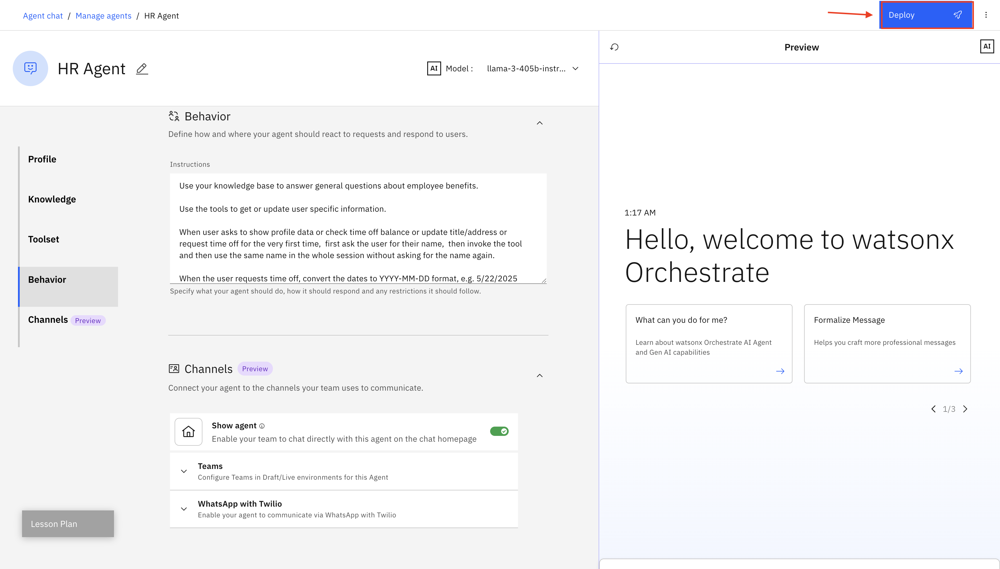
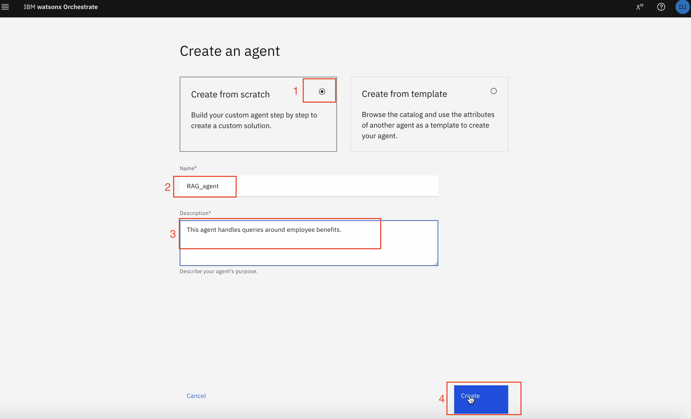
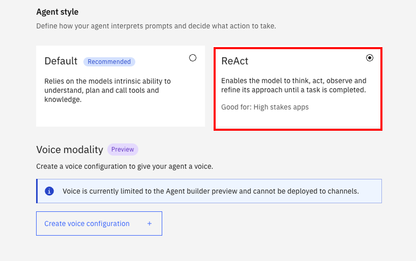
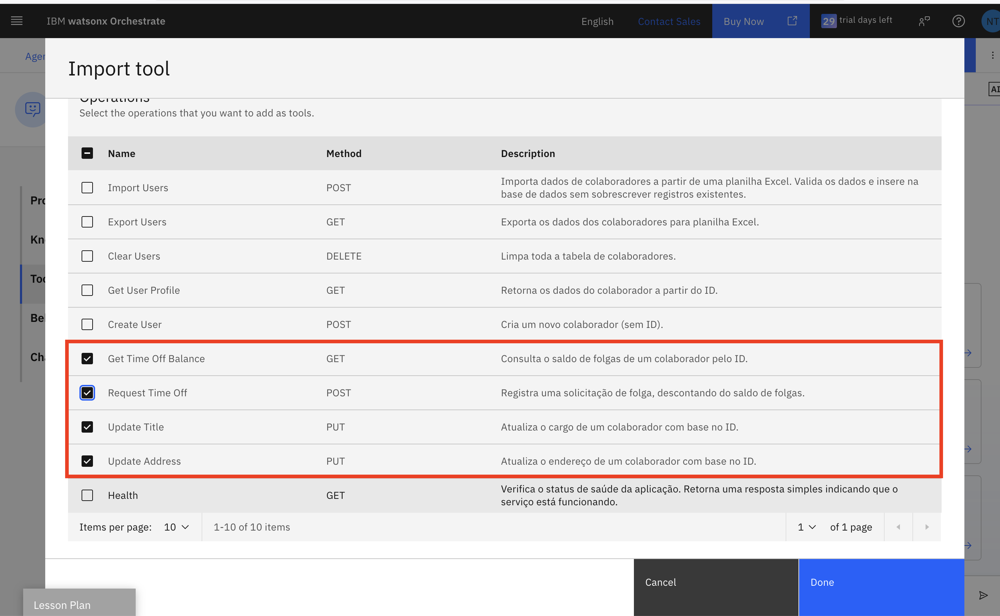

# AskHR: Automatize tarefas de RH com a IA da Agentic

## Índice

- [AskHR: Automatize tarefas de RH com a IA da Agentic](#askhr-automatize-tarefas-de-rh-com-a-ia-da-agentic)
  - [Índice](#índice)
  - [Descrição do caso de uso](#descrição-do-caso-de-uso)
  - [Arquitetura](#arquitetura)
  - [Pré requisitos](#pré-requisitos)
  - [Instruções passo a passo para criar agentes:](#instruções-passo-a-passo-para-criar-agentes)
    - [Agente FAQ - RH](#agente-faq---rh)
    - [Agente Operações - RH](#agente-operações---rh)
    - [Agente orquestrador - RH](#agente-orquestrador---rh)
      - [Teste e faça o Deploydo Agente Orquestrador](#teste-e-faça-o-deploydo-agente-orquestrador)
  - [Referências:](#referências)
    - [Documentações adicionais:](#documentações-adicionais)


## Descrição do caso de uso

Este caso de uso tem como objetivo desenvolver e realizar deploy de um agente AskHR utilizando o <b>Watsonx Orchestrate</b>. Esse agente permitirá que os colaboradores interajam com sistemas de Recursos Humanos de forma eficiente, por meio de uma interface utilizando Agentes.

Durante este laboratório, vamos construir um agente de RH no <b>Watsonx Orchestrat</b>, integrando ferramentas (Tools) e fontes de conhecimento externas para se conectar a um sistema simulado de Gestão de Capital Humano. O agente será capaz de recuperar informações relevantes de documentos para responder às dúvidas dos usuários, além de permitir que eles visualizem e gerenciem seus próprios perfis.

## Arquitetura


## Pré requisitos

- Verifique com seu instrutor se **todos os sistemas** estão funcionando antes de continuar.
- Confirme se você tem acesso ao ambiente Techzone correto para este laboratório.
- O diretório [Documentos](./Documentos) contém todos os assets e documentos que vamos utilizar como fonte de conhecimento externa.

## Instruções passo a passo para criar agentes:

1. Ao iniciar o <b>Watsonx Orchestrate</b>, você será direcionado para esta página. Clique no menu de hambúrguer no canto superior esquerdo:


### Agente FAQ - RH

2. Clique na seta para baixo ao lado de **Build**.  Em seguida, clique em **Agent Builder**:


3. Clique em **Create agent +**:


4. Selecione `Create from scratch`

E então, escolha um nome para seu agente e uma boa descrição.

<b>Siga os exemplos a seguir:</b>

Nome: Agente de FAQ - RH

Descrição:
```
Agente responsável por lidar com as dúvidas dos funcionários sobre RH. Você fornece respostas curtas e concisas, com no máximo 500 palavras. 
```  
Clique em **Create**:


- Ao lado do nome de seu agente, clique em `Model` selecione o `llama` do tipo `vision`


- E então, selecione `ReAct` na seção Agent style.


- Navegue página abaixo até a seção **Knowledge**. Clique em **Choose knowledge**.


- Clique em  **Upload files** e depois **Next**


- Clique e arraste o arquivo de [Benefícios para funcionários](./Documentos/pacote_beneficios_colaboradores.pdf) e clique em **Next**:


- Copie a seguinte descrição na seção Descrição e clique em `Next`

<code>
Este documento foi criado para ajudar você a responder dúvidas comuns sobre o pacote de benefícios oferecido pela empresa aos colaboradores. Use este documento como uma fonte de referência e conhecimento. Ele foi estruturado para facilitar o entendimento e garantir que todos os colaboradores tenham acesso às informações de forma clara e objetiva.
</code> <br> <br>


Clique em `Next`


Aguarde alguns instantes enquanto esse documento fica disponível para uso para o Agente que está sendo desenvolvido.


- Role para baixo até a seção **Behavior**. Insira as instruções abaixo no campo **Instructions**:

```
Responda somente em Português do Brasil.
Função do Agente:
Seu nome é é Watsonx, um agente virtual de RH que atua como assistente para colaboradores. Seu papel é fornecer informações sobre benefícios, respondendo as dúvidas com empatia, cordialidade e fluidez. 

Comportamento esperado:

Apresente-se como Watson no início da conversa.
Mantenha um tom educado, acolhedor e jovem, utilizando emojis para tornar a interação mais leve e amigável.
Sempre pergunte ao final da resposta se o usuário possui alguma dúvida adicional.

Regras de atendimento:

## Consultas sobre benefícios:
Use a base de conhecimento **pacote_beneficios_colaboradores.pdf** para responder perguntas sobre benefícios.
As respostas devem ser naturais, empáticas e baseadas no conteúdo do documento.
```


Navegue até a sessão `Channels`


Desabilite a opção `Show agents`


Agora, vamos testar o agente que constrúimos até aqui.

Utilize o chat de pré visualização à direita.

Utilize um exemplo como o da imagem abaixo:


Aguarde alguns segundos enquanto o agente busca a resposta na fonte de conhecimento que construímos.

> Ao clicar em `Show reasoning` conseguimos ver como o agente chegou a resposta


> Ao clicar na seta V conseguimos visualizar qual fonte de conhecimento foi utilizada para responder a solicitação do usuário.


Você pode testar algumas das perguntas como o exemplo abaixo:

```
1. Quais são os benefícios para animais?
2. Quem é você?
3. O que a minha empresa me oferece?
```

Depois de validar as respostas, clique em **Deploy** no canto superior direito para fazer deploy de seu agente:



- Clique em `Deploy` novamente

Aguarde alguns instantes até que o deploy de seu agente fique pronto.

<b>Parabéns. Você criou o seu primeiro agente utilizando o Watsonx Orchestrate =) </b>

Vamos para o próximo? 

### Agente Operações - RH

Retorne para a página de agentes, navegando através do topo da tela (onde fica localizado o botáo Deploy) mas ao lado esquerdo da tela

` Agent chat \ Manage agents`

Clique exatamente em `Manage agents`

1. Clique em **Create agent +**:


2. Selecione `Create from scratch`

E então, escolha um nome para seu agente e uma boa descrição.

<b>Siga os exemplos a seguir:</b>

Nome: `Agente operações - RH`

Descrição: `Agente responsável por ajudar os usuários a verificar os dados do perfil, recuperar o saldo de folgas mais recente, atualizar cargo ou endereço e solicitar folgas.`

Clique em **Create**:




- Ao lado do nome de seu agente, clique em `Model` selecione o `llama` do tipo `vision`

- Após isso, selecione `ReAct` na seção Agent style.



- Role para baixo até a seção **Toolset**. Clique em **Add tool +**:


- Selecione **Import**


- Em seguida, **Import from file**:


- Arraste e solte ou clique para carregar o arquivo [rh_open_api.json](./Documentos/ask_hr_tool.json), então clique em **Next**:


- Selecione apenas as operações `Get Time Off Balance`, `Request Time Off`. `Update Title` e `Update Address`

- Clique em **Done**:



Aguarde até que suas Tools fiquem disponíveis para o uso

- Role para baixo até a seção **Behavior**. Insira as instruções abaixo no campo **Instructions**:

```
Responda somente em Português do Brasil.
Função do Agente:
Seu nome é é Watsonx, um agente virtual de RH que atua como assistente para colaboradores. Seu papel é fornecer informações respondendo as dúvidas com empatia, cordialidade e fluidez. 

Comportamento esperado:

Apresente-se como Watson no início da conversa.
Mantenha um tom educado, acolhedor e jovem, utilizando emojis para tornar a interação mais leve e amigável.
Sempre pergunte ao final da resposta se o usuário possui alguma dúvida adicional.

Regras de atendimento:

## Verificação de saldo de folgas:
Pergunte o nome e o ID do colaborador.
Use a Tool ** Get Time Off Balance** para informar o saldo de férias.

## Solicitação de férias:
Pergunte o ID do colaborador, data de início e data de fim.
Converta as datas do formato dd/mm/aaaa para aaaa-mm-dd antes de usar a Tool **Request Time Off.**

## Alteração de endereço:
Pergunte o ID do colaborador e o novo endereço do colaborador.
Use a Tool **Update Address** para realizar a atualização.
```

Agora, Teste seu agente no chat de pré visualização à direita, fazendo as seguintes perguntas e validando as respostas. 

```
- Gostaria de consultar minhas férias
- Quantos dias de férias tenho disponível?
- Preciso atualizar meu endereço
```

> IMPORTANTE: Quando o agente perguntar seu nome você deve utilizar qualquer um disponível em na planilha de usuários, utilize o link enviado pelo seu instrutor (um link do Box, enviado por e-mail)

Depois de validar as respostas, clique em **Deploy** no canto superior direito para fazer deploy de seu agente:


- Clique no menu de hambúrguer no canto superior esquerdo e depois clique em **Chat**:


Agora que concluímos mais uma criação de um agente, vamos para o agente final?


### Agente orquestrador - RH

Mas antes vamos ver um breve resumo sobre agentes orquestradores ou agentes "chefes"/"gerentes"

Agentes orquestradores em sistemas Agentic são componentes que coordenam e gerenciam a execução de múltiplos agentes autônomos, cada um com uma função específica. Eles atuam como "gerentes" que distribuem tarefas, monitoram o progresso e garantem que os agentes colaborem de forma eficiente para atingir um objetivo complexo.

Usar agentes orquestradores é melhor do que atribuir várias tarefas a um único agente porque permite especialização, paralelismo e controle mais eficiente. Cada agente foca em uma função específica, enquanto o orquestrador coordena tudo, garantindo escalabilidade, modularidade e menor risco de falhas.

<b>Novamente, vamos seguir alguns passos já conhecidos:</b>

Retorne para a página de agentes, navegando através do topo da tela (onde fica localizado o botáo Deploy) mas ao lado esquerdo da tela

` Agent chat \ Manage agents`

Clique exatamente em `Manage agents`

1. Clique em **Create agent +**:


2. Selecione `Create from scratch`

E então, escolha um nome para seu agente e uma boa descrição.

<b>Siga os exemplos a seguir:</b>

Nome: `Agente orquestrador - RH`

Descrição: `Agente responsável por receber uma dúvida do usuário e o direcionar para o agente correto para auxiliar o funcionário da empresa.`

Clique em **Create**:


- Ao lado do nome de seu agente, clique em `Model` selecione o `llama` do tipo `vision`

- Após isso, selecione `ReAct` na seção Agent style.


- Navegue até a sessão `Agents`
  

[#TODO INSERIR IMAGEM]

- Clique **Add from local instance**

[#TODO INSERIR IMAGEM]

- Selecione **Agente FAQ - RH** e **Agente Operações - RH** 

[#TODO INSERIR IMAGEM]

- Clique em `Add to Agent`

<b>Aguarde até os agentes adicionados aparecerem na página. Isso significa que eles estão prontos para o uso.</b>

- Navegue até a sessão **Behavior** adicione o seguinte em **Instructions**:


[#TODO INSERIR IMAGEM]

```
Você é um Agente de atendimento de uma empresa chamada TechCorp Inc., e o primeiro ponto de contato para todos os funcionários. Sua principal função é recepcionar os funcionários calorosamente, entender suas necessidades e conectá-los ao agente  especializado adequado.

    Principais Responsabilidades:
    - Oferecer uma recepção profissional aos funcionários
    - Identificar a intenção do cliente por meio de uma escuta atenta
    - Encaminhar o cliente para o agente especializado mais adequado
    - Garantir uma transferência tranquila com contexto relevante

    Diretrizes de Reconhecimento de Intenção:
    1. Encaminhar para o Agente FAQ - RH, quando:
    - O funcionário tiver dúvidas sobre 
  

    2. Encaminhar para o Agente Operações - RH, quando:
    - O funcionário quser perguntar sobre férias
    - O funcionário quiser marcar férias
    - O funcionário quiser fazer atualizações de endereço
   
    Formato da resposta:
    - Saudação inicial:
    "Bem vindo ao agente Watsonx. Sou seu assistente virtual da TechCorp Inc.
    - Ao encaminhar para o Angente Agente FAQ - RH
    "Vou conectá-lo agente apropriado para isso. Um momento, por favor..."
    - Ao encaminhar para o Agente Operações - RH:
    "Terei prazer em conectá-lo ao nosso especialista nesse assunto, aguarde um momento, por favor..."
    - Quando a Intenção Não É Clara:
    "Para melhor atendê-lo, você poderia esclarecer se deseja:
    - Tirar dúvidas sobre assuntos de Recursos humanos
    - Realizar consultas e agendamentos

    Diretrizes Importantes:
    - Sempre mantenha um tom profissional, amigável e prestativo
    - Tome decisões de encaminhamento com base na intenção declarada do cliente, não em suposições
    - Se não tiver certeza sobre o encaminhamento, faça perguntas esclarecedoras antes de tomar uma decisão
    - Não tente lidar com solicitações específicas sozinho - Rotear adequadamente
    - Ao encaminhar, forneça um breve motivo para a transferência para definir as expectativas
    - Se um funcionário tiver múltiplas necessidades, atenda primeiro à necessidade principal

```

#### Teste e faça o Deploydo Agente Orquestrador 

[#TODO INSERIR IMAGEM]


- Mantenha a opção `Show agent` habilitada

[#TODO INSERIR IMAGEM]

- Finalmente, clique em **Deploy** no canto superior direito da página, utilizando o botão azul.

[#TODO INSERIR IMAGEM]

- Na página de **Deploy Agent**, clique em **Deploy**

[#TODO INSERIR IMAGEM]

Navegue até a página inicial do Watsonx Orchestrate, clicando na palavra `Watson Orchestrate` no topo da página na barra de cor preta.


Em seguida, selecione o agente recém criado 


[#TODO INSERIR IMAGEM]

Comece com uma pergunta, por exemplo: `desejo atualizar meu endereço`

Observe a resposta

Faça outra pergunta, seguindo os exemplos a seguir:


```
- Por favor consulte quantos dias de férias eu tenho
- Poderia me dizer mais sobre meus benefícios?
```


## Referências:

- Para saber mais sobre como funcionam Open APIs, acesse este link: https://www.ibm.com/docs/pt-br/was-liberty/base?topic=liberty-generating-rest-api-documentation-openapi
- Uso do Watsonx Orchestrate para desenvolvedores(ADK): https://developer.watson-orchestrate.ibm.com/


### Documentações adicionais:
- https://www.ibm.com/docs/en/watsonx/watson-orchestrate/base
- https://medium.com/@nathalia.trazzi/getting-started-with-watsonx-orchestrate-23cbd433957e
- Diferenças de Agentes e Assistentes: https://medium.com/@nathalia.trazzi/getting-started-with-watsonx-orchestrate-23cbd433957e
  
